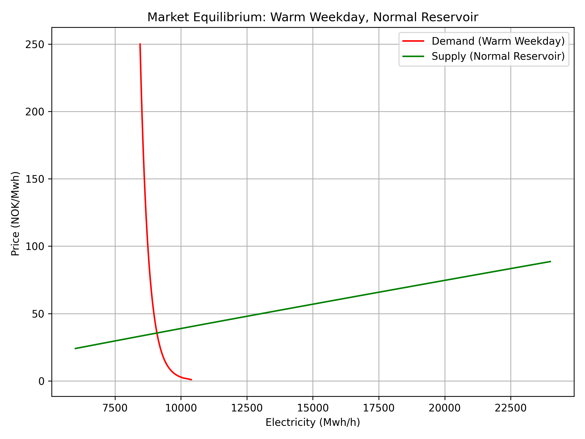
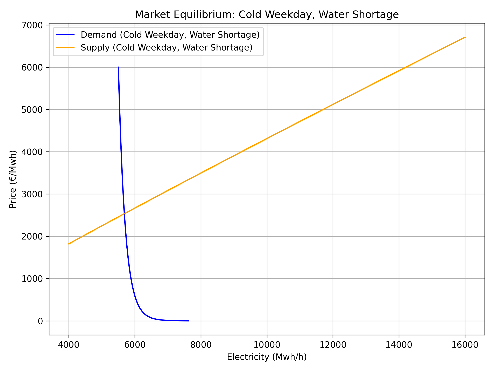

# Norway (NO1) Electricity Demand and Supply Equilibrium

This repository presents an empirical electricity market analysis of Norway’s NO1 price area using economic theory and econometric modelling techniques. The project estimates electricity demand and supply relationships, identifies market equilibrium outcomes, and analyses how weather conditions, fuel-related variables, and market fundamentals influence electricity prices and traded quantities.

The analysis combines structural market modelling with econometric methods commonly used in electricity market research, including Ordinary Least Squares (OLS), Instrumental Variables (IV/2SLS), and Generalized Method of Moments (GMM).

---

## Project Objectives

The main objectives of the project are to:

- Estimate electricity demand and supply curves for the NO1 market area
- Identify equilibrium electricity prices and quantities
- Analyse how temperature and market conditions affect electricity demand
- Examine how reservoir conditions, CO₂ prices, and fuel-related variables affect supply
- Address simultaneity and endogeneity in electricity market estimation
- Compare OLS, IV, and GMM estimation approaches
- Visualize market equilibrium and comparative statics under different scenarios

---

## Data

The project uses electricity market and economic data for Norway’s NO1 price area. The dataset includes variables such as:

- Electricity prices
- Electricity demand and supply
- Temperature
- Heating degree indicators
- CO₂ allowance prices
- Oil prices
- Reservoir levels
- Interest rates
- Weekend effects

Hourly observations are cleaned and prepared for econometric analysis.

> **Note:** The raw dataset is not made public. For questions regarding the data, please send a message to: `skwesi50@gmail.com`

---

## Methodology

### 1. Demand Estimation

Electricity demand is modelled as a function of:

- Electricity prices
- Heating demand driven by temperature
- Weekend effects
- Fuel-related market conditions

The analysis begins with OLS estimation before applying Instrumental Variables and GMM methods to address endogeneity between prices and quantities.

The demand-side analysis includes:

- OLS estimation
- IV / 2SLS estimation
- GMM estimation
- Weak instrument tests
- Hausman-Wu endogeneity tests
- Sargan overidentification tests
- Heteroskedasticity diagnostics

---

### 2. Supply Estimation

The supply side models electricity prices as a function of:

- Electricity generation
- CO₂ prices
- Oil prices
- Interest rates
- Reservoir conditions
- Weather conditions

Alternative instrument specifications are explored to evaluate model robustness and instrument validity.

---

### 3. Market Equilibrium Analysis

Estimated demand and supply curves are combined to identify market equilibrium outcomes under different market conditions.

The project examines how equilibrium changes under scenarios such as:

- Warm weekday with normal reservoir conditions
- Cold weekday with water shortage conditions
- Low versus high CO₂ prices
- Alternative econometric specifications

Comparative statics are used to illustrate how demand and supply shifts affect equilibrium prices and quantities.

---

## Example Equilibrium Scenarios

The figures below illustrate how electricity market equilibrium changes under different temperature and reservoir conditions in Norway’s NO1 electricity market.

<p align="center">
  
  
</p>

<p align="center">
  <em>
  Left: Warm weekday with normal reservoir conditions.  
  Right: Cold weekday with water shortage conditions.
  </em>
</p>

The warm weekday scenario represents a relatively stable market situation, where normal reservoir conditions support electricity supply and prices remain comparatively moderate.

The cold weekday with water shortage scenario illustrates a tighter market condition. Demand increases because of heating needs, while hydropower supply becomes more constrained due to reduced water availability. As a result, the equilibrium price rises substantially and the market clears at a lower available supply level.

---

## Repository Structure

```text
├── data/               # Local data folder; raw dataset is not public.
├── notebook/           # Jupyter notebook used for analysis
├── figures/            # Generated equilibrium plots and figures
├── .gitignore          # Files excluded from GitHub
└── README.md
```

---

## Tools and Libraries

The project is implemented in Python using:

- pandas
- numpy
- matplotlib
- scipy
- statsmodels
- linearmodels

---

## Example Outputs

The repository includes:

- Estimated demand and supply curves
- Market equilibrium plots
- Instrument validity diagnostics
- Weak instrument tests
- GMM estimation results
- Weather-driven demand shift analysis
- Reservoir-condition supply shift analysis
- CO₂-price-driven supply shift analysis

---

## Key Findings

The analysis highlights several important features of electricity markets:

- Electricity demand in Norway is strongly influenced by temperature conditions
- Cold weather increases electricity demand because of heating needs
- Reservoir conditions affect the supply side of the market, especially in a hydropower-dominated system
- Endogeneity between prices and quantities can bias simple OLS estimates
- IV and GMM approaches provide more economically meaningful elasticity estimates
- Market equilibrium is highly sensitive to weather conditions, reservoir availability, and fuel-related costs

---

## Limitations

This project is intended as a simplified structural equilibrium analysis and abstracts from several real-world electricity market complexities, including:

- Transmission constraints
- Cross-border electricity trade
- Hydropower reservoir optimization
- Unit commitment constraints
- Renewable intermittency
- Zonal congestion effects
- Strategic bidding behaviour

The results should therefore be interpreted as an empirical learning exercise rather than a full operational electricity market model.

---

## Future Extensions

Possible future extensions include:

- Multi-zone Nordic electricity market analysis
- Dynamic hydropower reservoir modelling
- Renewable generation integration
- Time-varying demand and supply elasticities
- More detailed treatment of fuel and CO₂ price shocks
- Machine learning approaches for electricity market analysis
- Scenario-based stochastic modelling

---

## Author

Samuel Kumi  
MSc Applied Economics and Sustainability  
Norwegian University of Life Sciences (NMBU)